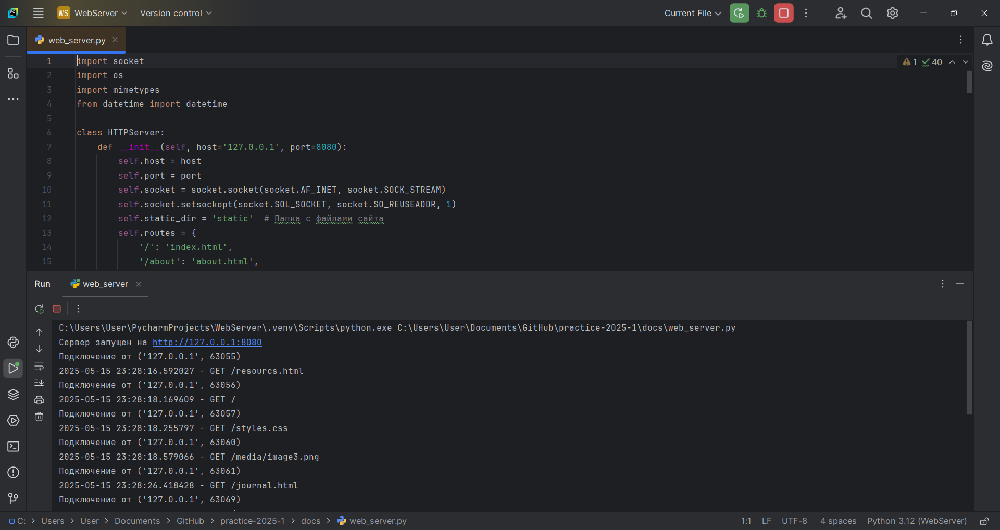
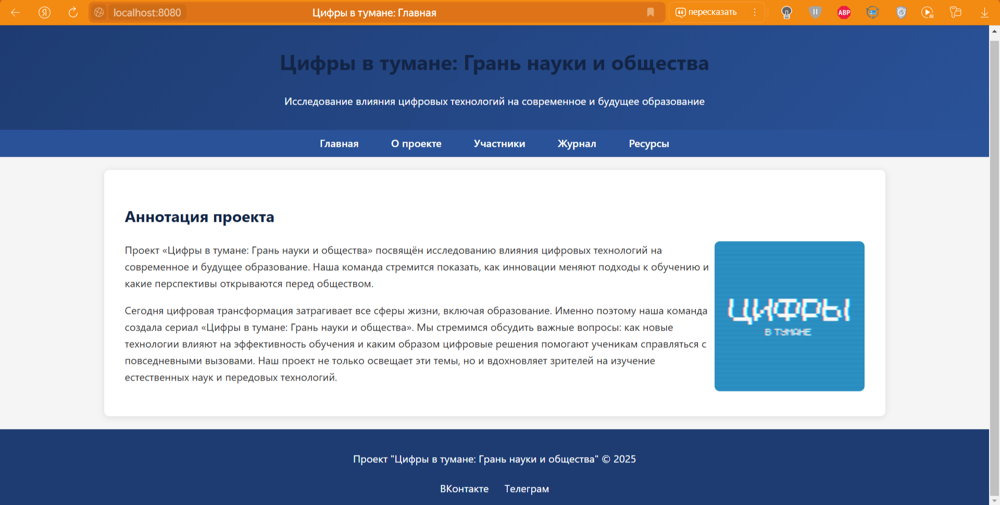

# Вариативная часть задания  
Выбор тематики. Мной была выбрана тема – **«Создание простого веб-сервера на Python с использованием модуля socket»**.  

---

# 🌐 Проект: Простой веб-сервер на Python  

## 🎯 Цель проекта  
Разработка простого веб-сервера на языке Python с использованием модуля `socket`, способного обрабатывать HTTP-запросы, отдавать статические файлы (HTML, CSS, изображения) и поддерживать базовую маршрутизацию.  

## 🎯 Задачи проекта  
- Изучить основы работы с сокетами в Python.  
- Реализовать обработку HTTP-запросов (GET).  
- Настроить отдачу статических файлов (HTML, CSS, изображений).  
- Добавить простую маршрутизацию URL.  
- Обеспечить корректное определение MIME-типов файлов.  
- Реализовать обработку ошибок (404, 403).  
- Провести тестирование сервера на локальной машине.  

---

## 🔍 Исследование и разработка  

### 1. Выбор тематики  
Была выбрана тема: **«Создание простого веб-сервера на Python»** — это отличный способ понять основы работы HTTP-серверов и сетевого программирования.  

### 2. Стек технологий  

| Компонент       | Выбор                   |  
|-----------------|-------------------------|  
| Язык            | Python                  |  
| Основной модуль | `socket`                |  
| Дополнительно   | `mimetypes`, `os`       |  

---

### 3. Изучение технологии  
Мной были изучены материалы по работе с сокетами и HTTP-протоколом. В результате:  
- Создан основной файл: `web_server.py`, в котором реализованы:  
  - Обработка входящих соединений через `socket`.  
  - Парсинг HTTP-запросов.  
  - Отдача статических файлов из папки `static`.  
  - Базовая маршрутизация URL.  
  - Обработка ошибок (404, 403).  

---

## 🛠 Техническое руководство  

### Необходимое ПО  
- Python 3.x (https://python.org)  
- Любой браузер для тестирования  

---

### 🔧 Шаг 1: Импорт библиотек и создание сервера  

```python
import socket
import os
import mimetypes
from datetime import datetime

class HTTPServer:
    def __init__(self, host='127.0.0.1', port=8080):
        self.host = host
        self.port = port
        self.socket = socket.socket(socket.AF_INET, socket.SOCK_STREAM)
        self.socket.setsockopt(socket.SOL_SOCKET, socket.SO_REUSEADDR, 1)
        self.static_dir = 'static'
```

### 🔧 Шаг 2: Запуск сервера и обработка подключений  

```python
def serve_forever(self):
    self.socket.bind((self.host, self.port))
    self.socket.listen(5)
    print(f"Сервер запущен на http://{self.host}:{self.port}")

    while True:
        conn, addr = self.socket.accept()
        self.handle_request(conn)
        conn.close()
```

### 🔧 Шаг 3: Обработка HTTP-запросов  

```python
def handle_request(self, conn):
    data = conn.recv(1024).decode('utf-8')
    request_line = data.split('\r\n')[0]
    method, path, _ = request_line.split()

    if method == 'GET':
        file_path = os.path.join(self.static_dir, path.lstrip('/'))
        if os.path.exists(file_path):
            self.serve_file(conn, file_path)
        else:
            self.send_error(conn, 404, "Not Found")
```

### 🔧 Шаг 4: Отдача статических файлов  

```python
def serve_file(self, conn, file_path):
    with open(file_path, 'rb') as f:
        content = f.read()
    
    mime_type, _ = mimetypes.guess_type(file_path)
    response = (
        "HTTP/1.1 200 OK\r\n"
        f"Content-Type: {mime_type}\r\n"
        f"Content-Length: {len(content)}\r\n"
        "\r\n"
    ).encode('utf-8') + content
    conn.sendall(response)
```

### 🔧 Шаг 5: Обработка ошибок  

```python
def send_error(self, conn, code, message):
    error_page = f"<html><body><h1>{code} {message}</h1></body></html>"
    response = (
        f"HTTP/1.1 {code} {message}\r\n"
        "Content-Type: text/html\r\n"
        f"Content-Length: {len(error_page)}\r\n"
        "\r\n"
    ).encode('utf-8') + error_page.encode('utf-8')
    conn.sendall(response)
```

### 🔧 Шаг 6: Запуск сервера  

```python
if __name__ == '__main__':
    server = HTTPServer()
    server.serve_forever()
```

---

## 💻 Пример работы  

### 1. Запуск сервера  
  

### 2. Открытие в браузере  
  

### 3. Ошибка 404  


---

## ✍ Подведение итогов и вывод  

В рамках данного проекта была успешно реализована цель — создание простого веб-сервера, способного обрабатывать HTTP-запросы и отдавать статические файлы. Для реализации был выбран Python и модуль `socket`, что позволило глубоко изучить основы сетевого программирования.  

**Вывод:** Проект позволил на практике освоить принципы работы веб-серверов, обработку HTTP-запросов и отдачу контента. Разработанный сервер можно использовать как основу для более сложных проектов, например, добавления поддержки динамического контента или многопоточной обработки запросов. Таким образом, поставленные задачи выполнены в полном объеме.  

---

## 📄 Список литературы  
1. Официальная документация Python: модуль `socket` [Электронный ресурс]. – Режим доступа: https://docs.python.org/3/library/socket.html (дата обращения: 05.05.2025).  
2. Основы HTTP-протокола [Электронный ресурс] // MDN Web Docs. – Режим доступа: https://developer.mozilla.org/ru/docs/Web/HTTP (дата обращения: 05.05.2025).
